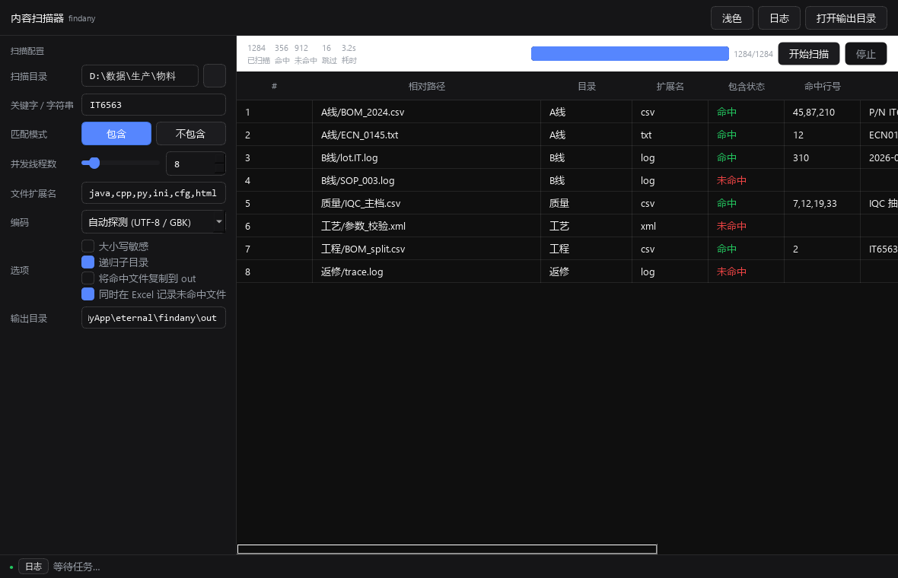

<div align="center">
  
  <h1>findany</h1>
  <p>目录内容扫描器 —— 在指定目录树下并发检索文件内容，判定「包含 / 不包含」关键字，一键导出 Excel 并落盘命中文件。</p>

  [](https://github.com/)
  [](https://www.rust-lang.org/)
  [-5C2D91)](https://github.com/emilk/egui)
  [](LICENSE)
</div>

<div align="center">
  
</div>

> 一次配置，并发扫描，结果即出。生产 / 物料 / 工程等场景里的「有没有出现某个关键字」排查利器。

findany 是一个跨平台桌面程序，用 **Rust + egui（eframe）** 编写（v2.0 起由 PySide6 版整体重写，与 etest 同一技术栈），核心扫描/筛选引擎不依赖 UI、可独立复用。对目录下所有文件做「**包含 / 不包含**」关键字判定，支持并发、编码探测、二进制/超大文件跳过、Excel 明细与摘要输出，并把命中文件按 `out/日期时间/目录/文件` 落盘。

> **为什么换技术栈**：PySide6 版只能跑 Windows、单文件包 66MB、冷启动慢；Rust 版单文件可执行、静态零运行时依赖，同一份源码可在 Windows 与麒麟 V10 / UOS V20 / Ubuntu 18.04+ 上编译（eframe GLX 兼容 patch 与 etest 共用）。

## 功能特性

- `🦀` **单文件零依赖**：Rust 静态编译，一个 exe 双击即用，无需 Python / Node / 浏览器。
- `📁` **全目录递归**：扫描根目录下所有子目录与文件，按扩展名过滤。
- `🔍` **包含 / 不包含**：两种匹配模式，一次看清「谁命中了 IT6563 / 谁没有」。
- `⚡` **并发扫描**：线程 1~64 可配，I/O 密集。
- `📊` **表格实时渲染**：扫描 / 筛选**边跑边出表**——worker 每批结果（24 条或 250ms，先到先发）即时 append 到表格，不必等全部跑完；顶部统计与进度条读共享计数器，始终跟手。
- `🚀` **大目录不卡界面**：单帧事件消费有预算（2000 条 / 6ms，超出留到下一帧）+ 日志同类去抖 + 配置检测 250ms 节流 + 表格按可见行渲染。实测 **29400 个文件**：release 版扫描 3.5s，界面单帧最坏 **6.6ms**（≈60fps 不掉帧）。
- `⏱` **渲染节奏可控**：`filter.ui_refresh_ms`（运行参数里的「界面刷新」滑块）控制推批间隔；点「开始扫描」立刻进入「启动中…」过渡态（可取消），不等 worker。
- `👁` **结果表跟随**：运行中默认「跟随最新（自动滚到底）」，每来一批新行就把滚动条钉到底；用户一拖滚动条就自动取消跟随，不抢操作。
- `💥` **崩溃可诊断**：panic 一律写 `logs/crash.txt`（源位置 + 消息 + **带函数名的 backtrace**，release 也保留符号）；GUI 模式额外弹「❌BUG跟踪Panic」错误框，CLI 模式（`--auto`/`--selftest` 等）只落盘不弹窗，避免无人值守被模态框卡死。自证命令：`findany --panictest [--no-dialog]`
- `🛡` **布局防 NaN（三层）**：① 每帧先把根 Ui 的 max_rect 夹成有限值；② 表格视口宽高非有限就直接跳过定高；③ 极端尺寸也不会把 NaN 喂给 egui。`just verify` 里跑 **9 组窗口尺寸 × 3 帧**（含 0×0、1×1、5×5、NaN×400、400×NaN）的渲染回归。
- `⚡` **点击即响应**：点「开始」后界面**零阻塞**——目录遍历/统计全部交给后台线程（旧实现在 UI 线程同步数一遍目录树，几万文件时就是那一下卡顿），按钮与状态条当帧就变。
- `💬` **操作必有反馈**：动作区常驻状态条（✖ 错误 / ▲ 警告 / ✔ 成功 / ● 进行中）——校验失败、目录不存在、启动中、完成、失败都会出字，绝不"点了没反应"。
- `🧾` **Excel 输出**：明细 + 摘要双 sheet（umya-spreadsheet 直接写 xlsx，无外部依赖）。
- `📦` **命中文件落盘**：按 `out/<YYYY-MM-DD_HH-MM>/{目录}/{文件}` 复制，同名自动加序号。
- `🧩` **编码智能**：编码探测 + 多编码严格降级链（utf-8/GBK/UTF-16），最后 UTF-8 宽容兜底，杜绝乱码误判。
- `🛡️` **稳健**：二进制 / 超大文件跳过，输出目录自扫描排除，无权限文件记日志不中断。
- `💬` **日志弹窗**：运行日志实时滚动，按级别着色，可清空 / 关闭。
- `🧭` **日志筛选 / 数据回传**：内置 etest(OA3) / etest / e-autotest 三类判型提取，通用 CLI 回传（intunehelper 预设）+ dry-run + 回传进度条 + 完成倒计时自动关。
- `🚦` **回传拦截**：数据为空、或**开了正式回传却没真回传**（定向类型一台没匹配到 / 一台没回传 / 有失败冲突）→ 不判 PASS、不倒计时不关窗，R 结论 `status=false`；界面与 R 结论共用同一套判定。
- `🧷` **状态就地刷新**：回传过程中同一份日志的那一行只改状态（回传状态/退出码/request_id），不重复追加、不整表替换 —— 表格只有一轮的数据，收尾也不重排。
- `💾` **一键导出**：结果表上「导出当前数据」把表里现有数据写成正式产物（批次目录 + Excel + 审计 CSV），中途停止后照样能留档；导出在**后台线程**跑，界面不卡。
- `🖥` **服务器友好**：`throttle_ms`（每批休眠）/ `max_files`（文件数上限）/ `threads`（并发）/**`process_priority`**（进程优先级，仅 Windows）四项都在「运行参数」里可调，也写在 toml 里；`--auto` 无人值守时进程优先级同样生效。
- `🚫` **无控制台黑框**：release 是 Windows GUI 子系统（与 gpu-test 同款 `windows_subsystem`），双击不闪命令行窗口；CLI 模式 `AttachConsole` 借父控制台，cmd/计划任务/管道下 stdout 照旧（重定向句柄会先存后还，`--auto > run.txt` 也能拿到输出）。
- `📦` **安装包**：`just msi`（cargo-wix + WiX v3）/ `just deb`（cargo-deb）；装完自动把配置/日志/产物落到用户目录（`FINDANY_HOME` > exe 目录可写 > 用户目录）。
- `🎨` **深 / 浅主题**：一键切换。
- `agensec` **配置面板收放**：「扫描配置」右上角「收/展」按钮折叠配置；收起时标题与内容全藏，面板只剩「展」按钮（84px 宽），右侧结果区全幅；展开恢复 440px。

## 系统要求

| 依赖 | 版本 | 说明 |
| --- | --- | --- |
| Windows | 10 / 11 | 桌面运行环境（已验证） |
| Linux | 麒麟 V10 / UOS V20 / Ubuntu 18.04+ | 需装 `libgl1 libegl1 libxcursor1 libxi6 libxrandr2 libxinerama1 libxkbcommon0 libxkbcommon-x11-0` |
| Rust | 1.80+ | 仅构建需要；运行时零依赖 |
## 构建

推荐用 **just**（`cargo install just`）——与 etest 同一套命令骨架：

```bash
just                  # 列出全部命令
just doctor           # 环境自检（工具链 / 样例 / 交付材料）
just run              # 本机跑 GUI（debug）
just run-auto         # 无窗口自动化（读程序目录 findany.toml）
just selftest         # 端到端自检 65 条断言（对 doc/etest-log 生产样例）
just parity           # 移植对拍：Rust vs v1 Python（字段 + 批次产物结构）
just check            # cargo check + cargo test
just verify           # 一键全验证：编译检查+自检+界面虚拟化+对拍+产物结构
just dist             # Windows 包 -> dist/findany-v<版本>.zip
just release          # 构建 + 自检 + 对拍 + 打包（发布入口）
```

也可以直接用 cargo：

```bash
cargo build --release
# Windows: target/release/findany.exe   # Linux: target/release/findany
```

依赖来自 crates.io 镜像（见 `.cargo/config.toml`，rsproxy 加速）；`e-utils` 以 path 引用本地仓库（`../e-utils`），与 etest 共用。

## 运行

双击 **`target/release/findany.exe`** 即启动 GUI（启动时自动隐藏控制台窗口）。命令行：

```bash
findany                                 # GUI（控制台隐藏）
findany --config x.toml                  # GUI + 按 TOML 自动跑「检测→回传→倒计时关」（等价 auto_start=true）
findany --auto --config x.toml           # 无窗口跑完即退（产线无人值守；退出码 0=成功，2=首次生成模板）
findany --selftest doc/etest-log         # 自检 65 条断言（对生产样例，无 GUI）
findany --qa doc/etest-log               # 导出提取结果为 JSON（移植对拍用）
findany --qa-filter doc/etest-log tmp/   # 跑一遍筛选并打印批次目录（产物结构对拍用）
findany --bench D:/logs                  # 压测：目录规模 vs 扫描耗时 vs 界面单帧最坏耗时
findany --panictest --no-dialog          # 崩溃钩子自证：写 logs/crash.txt 后 101 退出（CLI 形态不弹窗）
findany --uitest                         # 验证表格虚拟化：每帧只渲染一屏行（与数据量无关）
```

> 控制台策略：release 版保留 console 子系统，因此 CLI 模式的输出与退出码都能被脚本读到；GUI 模式在启动第一件事就把控制台窗口 `ShowWindow(SW_HIDE)`，用户视角等同无控制台的桌面程序。
>
> **性能**：大目录请用 **release 版本**（`target/release/findany.exe`）——debug 版扫描同样是 2.9 万文件要 30s+，release 只要 3.5s（差距在正则与编码解码未优化）。`just run` 跑的是 debug，仅供界面调试。

全流程日志写 `logs/`（5MB 轮转）：`findany.log`（自动化）/ `findany-gui.log`（界面操作）。

## 使用说明

1. 选择**扫描目录**（「…」浏览）。
2. 输入**关键字**（如 `IT6563`）。
3. 选择**匹配模式**：包含 = 内容含关键字即命中；不包含 = 内容不含关键字即命中。
4. 调整**并发线程数**（1~64）、**扩展名**（逗号分隔，留空=全部）、**编码**、各开关。
5. 点**开始扫描**，右侧实时显示统计与进度，可随时**停止**。
6. 完成弹窗提示，可一键**打开输出目录**。

## 日志筛选 / 数据回传（工作模式切换）

顶栏「工作模式」切到 **日志筛选** 后，左侧出现筛选 / 回传面板：

| 配置项 | 说明 | 默认 |
| --- | --- | --- |
| 筛选类型 | 自动识别 / etest(OA3) / etest / e-autotest / 海格旧测试2 / 海格旧测试3 | 自动识别 |
| 界面（筛选页） | 与通用扫描**共享**：扫描目录 / 输出目录 / 并发线程数 / 编码 / 文件扩展名 / 选项（递归子目录、将命中文件复制到 out=留存命中日志）；扫描专属项（关键字 / 匹配模式 / 大小写敏感 / 记录未命中）自动**隐藏** | — |
| 判型规则 | 文件名 `AUTO2`→e-autotest；`IFT-START`/`SN` 前缀→海格旧测试2；`IFT/CLEAN/BURN/FFT/BATTERY/BFT*` 前缀→海格旧测试3；含 `OA3 inject Start`/`<HardwareHash>`→etest(OA3)；首行含 `: e-autotest`→e-autotest；尾部 `R<{`→etest；其余=未知（对齐 heg-admin-log `parse_path_type` 顺序） | — |
| 启用数据回传 | 提取成功后逐台调第三方 CLI；自动模式下仅 etest(OA3) 参与回传 | 关 |
| dry-run | 只组包校验四字段，不调 CLI、不碰网 | 开 |
| CLI 路径 | 空=程序目录（或 `doc/devicehashupload/`）下 `intunehelper_cli.exe` | 空 |
| SecretKey | 存 `findany.toml`（已 gitignore，不进源码/日志，按交付 SOP 第 6 条） | 空 |
| 参数模板 | 占位符 `~key~`：`~secret_key~` / `~payload~` / 提取字段；含 `~payload~` 走参数否则写 stdin | `upload --stdin --secret-key ~secret_key~` |
| 超时 / 重试 | 单台 CLI 超时；退出码 21 自动重试（1/2/4s 退避），10/12/20/30 不重试 | 60s / 3 次 |
| 倒计时自动关 | 完成后倒计时归零自动退出程序；弹窗可取消 / 延时 30s / 打开输出目录；**数据为空或回传异常时不关** | 3s，默认关 |
| 界面刷新 | 运行参数里的滑块：扫描/筛选时每隔多久把新结果推一批给表格（0=只在结束时出表） | 200ms |
| 启动后自动运行 | 左侧面板「**自动运行**」分组里的勾选（= `run.auto_start`）：勾上即写入 toml，下次打开程序按当前工作模式自动开跑；展开后同组可设「完成后倒计时」与「归零自动关程序」 | 关 |
| 顶栏 | 只留「保存配置」+「开始」两个按钮（168px 定宽）；收起面板 / 浅色主题 / 运行日志 / 重新载入 全在左侧面板顶部 | — |
| 扫描目录 | 一个输入框：指向**目录**按目录扫描，指向**单个文件**按单文件处理（v2 起取消了 SN 关联 / 单文件专用方案） | 空 |

**回传判定**（移植 etest-core `check_result` 思路，规则可配）：退出码 0 且 stdout `status∈{accepted, duplicate_accepted}` 双确认=成功；退出码 12=冲突转人工（黄）；其余=失败（红）。结果审计落 `out/<时间>/upload-result.csv`（不含 Hash 与 SecretKey）。

**产物**：`out/<YYYY-MM-DD_HH-MM>/` 下 `filter_result.xlsx`、`upload-result.csv`（回传审计）、命中日志留存。
Excel 明细为**统一模板 36 列**（6 组逻辑排序：识别→设备→网络→OA3→原始→结果，OA3 组含 **HardwareHash 本体** 4000 字符全值）+ 摘要 sheet；**批次自适应**：本批整列全空自动隐藏、列宽按内容自适应、冻结表头+序号/文件列（openpyxl 缺失降级 CSV）。
另有**按判型动态生成的专属 sheet**（etest(OA3)/etest/e-autotest/海格旧测试2/海格旧测试3 各用各的列集，批内没有的类型不生成；未知类型只落总表兜底）。新判型在 `src/core/logfilter/report.rs::type_templates` 登记即获得专属模板。

## 验收输出（etest `R<...>R` 标准）

运行结束的**最后一行**就是平台可直接校验的结果，格式与 etest-core / e-autotest 完全一致：

```
R<{"content":"提取 6/6（未知 0，跳过 0），回传 成功 6/冲突 0/失败 0，耗时 1.23s，产物 out/2026-09-21_09-02（2026-09-21 09:02:27）","opts":{"api":"None","task":"","init":false,"full":false,"filter":[],"args":[],"command":[],"mode":"filter"},"status":true}>R
```

| 位置 | 内容 |
|---|---|
| stdout | 末尾一行 `R<...>R`（平台抓 stdout 时用） |
| `logs/findany.log` | 诊断行 + **末尾一行 `R<...>R`**（无任何前缀，取最后一条即最新结论） |
| `logs/findany-result.log` | 覆盖写，只留最新一条（`is_check=true` 的 APP 直接读结果文件） |

- `status: true` = 通过；`false` 时 `content` 即失败原因（空数据拦截 / 回传冲突或失败 / 扫描零命中）
- `content` 是可读结论：提取数、未知类型、跳过数、回传成功/冲突/失败、耗时、产物目录、结束时间
- 进程退出码与之一致：`0`=通过，`1`=失败，`2`=首次生成配置模板
- 解析契约同 etest-core `commond.rs::parse_rlog_last`：正则 `R<(?s:.*?)>R` 取**最后一条**，反序列化为 `e_utils::cmd::CmdResult`（`content` / `status` / `opts`）

> 平台侧对接：APP 配置里把 `is_check` 设为 `true`、`filter` 留空（走 `R<...>R` 校验），结果文件指向 `logs/findany.log`；判定只认最后一行。

**自校验 / 移植对拍**（对 doc/etest-log 6 份生产样例）：

```bash
findany --selftest doc/etest-log     # 65 条端到端断言（判型/字段/Excel 产物/dry-run 组包）
powershell -File qa_parity.ps1       # Rust 版 vs v1 Python 版提取结果逐字段对拍
```

Rust 版对拍结果：**6 份样例、507 条 Python 侧字段断言、差异 0**（Rust 侧另有 43 个超集字段）。
参照系取 `legacy/v1-python/`（对拍时用 `git archive HEAD` 从 git 历史导出，不入库）。

## 日志标准

| 运行方式 | 日志文件 | 内容 |
|---|---|---|
| CLI / TOML 自动化（auto_start=true 或 --config x.toml） | logs/findany.log | 启动模式、会话横幅、自动化全流程、异常堆栈 |
| GUI 人工操作 | logs/findany-gui.log | 同上 + 全部界面操作日志（筛选/回传/保存等） |

5MB 自动轮转（.log.1）；旧的 findany-run/startup/crash 散文件已并入标准日志。

## TOML 自动化（检测 → 回传 → 倒计时关）

程序目录放 **`findany.toml`**（或 `findany.exe --config 路径.toml`），`run.auto_start = true` 即启动后自动开跑，完成按倒计时自动关——产线无人值守。

> **首次运行自动生成**：启动时若找不到 toml，程序会输出一份默认模板（含全字段注释）并提示路径；编辑 `root_dir`/`scheme` 后把 `run.auto_start` 改 `true` 即生效。模板已 gitignore（防后续填入的 SecretKey 入库）。
>
> **唯一配置文件**：v2 起 `findany.toml` 就是全部配置（config.json 已取消）。GUI 里改设置**不会自动落盘**：顶栏会亮「● 有改动，点「保存配置」写回」，点「保存配置」才按节合并写回 toml（保留注释与 `run.auto_start` 手工开关，缺失键补齐；**已存在的 toml 从不整体重建**，只有文件不存在时才生成默认模板）。按钮落盘后亮「已保存 ✓」（绿）/「保存失败」（红）1.2 秒。

```toml
[filter]
root_dir = "D:\\logs"          # 扫描根目录（也可指向单个文件）
log_type = "auto"              # auto|etest(OA3)|etest|e-autotest|海格旧测试2|海格旧测试3
recursive = true               # 递归子目录
keyword = "IT6563"             # 通用扫描关键字
mode = "inc"                   # inc 包含 | exc 不包含
extensions = ["txt","log"]     # 扩展名过滤；留空=全部
encoding = "auto"              # auto|utf-8|gbk|gb2312|utf-16|latin-1|ascii
threads = 8                    # 并发线程 1~64
case_sensitive = false
copy_files = false             # 命中文件复制到 out（筛选模式下=留存命中日志）
record_miss = true             # Excel 记录未命中
max_file_mb = 20.0             # 超过视为二进制/超大，跳过
out_dir = ""                   # 输出根目录；空=程序目录 out/

[run]
auto_start = true              # true：启动即自动「检测→回传→倒计时关」
countdown_sec = 3              # 完成后倒计时，归零自动关
auto_close = true

[upload]
enabled = true
dry_run = false                # 上线前先 true 演练
types = ["etest(OA3)"]
cli_path = ""
secret_key = ""
args = "upload --stdin --secret-key ~secret_key~"
timeout_sec = 60
max_retries = 3
```

命令行：`findany.exe --config findany.toml`（不给 `--config` 就用程序目录的 `findany.toml`）。

## 配置

| 配置项 | 说明 | 默认值 |
| --- | --- | --- |
| `root_dir` | 扫描根目录**或单个文件**（GUI 行内「目录…」/「文件…」双按钮；指向文件时按单文件处理，两种工作模式通用） | 空 |
| `keyword` | 要检索的关键字 | `IT6563` |
| `mode` | `inc` 包含 / `exc` 不包含 | `inc` |
| `threads` | 并发线程数 1~64 | `8` |
| `extensions` | 扩展名过滤（逗号分隔，空=全部） | txt,log,csv,md,xml,json,java,cpp,py,ini,cfg,html |
| `encoding` | auto / utf-8 / gbk / utf-16 / ascii | `auto` |
| `case_sensitive` | 大小写敏感 | `false` |
| `recursive` | 递归子目录 | `true` |
| `copy_files` | 将命中文件复制到 out | `false` |
| `record_miss` | 在 Excel 记录未命中文件 | `true` |
| `out_dir` | 输出根目录 | 程序目录下 `out/` |
| `max_file_mb` | 超过视为超大/二进制并跳过 | `20` |
| `ui_refresh_ms` | 界面实时渲染间隔(ms)，0=只在结束时出结果 | `200` |
| `throttle_ms` | **每批之间的休眠(ms, 0~5000)**：给 CPU/磁盘/网络盘让路 | `0` |
| `max_files` | **最多处理多少个文件(0=不限)**：防目录跑飞 | `0` |
| `process_priority` | **进程优先级** `normal` / `below_normal` / `idle`（仅 Windows 生效） | `normal` |

### 服务器上跑：压资源的三档开关

```toml
[filter]
threads = 2          # 并发线程：1~4 足够，别把服务器 CPU 吃满anthrottle_ms = 100   # 每批之间让 100ms：CPU 占用与磁盘/网络盘 IO 突发都会明显降下来
max_files = 5000     # 目录跑飞时的保险丝（0=不限）

[run]
process_priority = "below_normal"   # 或 idle：Windows 会把它的 CPU/IO 优先级降到生产任务之下
```

也可以直接命令行临时压：`findany.exe --auto` 前用 `start /low /wait findany.exe --auto`（Windows）或 `nice -n 19`（Linux）。

> 注意：`process_priority` 只在**进程启动时**生效（改完重启程序）；`throttle_ms`/`max_files`/`threads` 下次运行即生效。

配置持久化到 **`findany.toml`**（唯一配置文件，程序目录下）：启动加载，**只在点「保存配置」时写回**（没有自动保存；已存在的文件不会被整体重建）。

## 输出

```
<程序目录>/out/
 └─ <YYYY-MM-DD_HH-MM>/           # 本次批次（同分钟自动加序号，不覆盖）
     ├─ scan_result.xlsx          # 明细 + 摘要
     └─ {目录}/{文件}             # 命中文件（勾选「复制到 out」才复制）
```

明细列：序号、相对路径、目录、扩展名、包含状态、命中行号、命中行内容、匹配计数、大小、修改时间、编码、绝对路径。

## 日志

程序日志统一写入 `logs/`（`logs/` 已 gitignore），按运行方式分文件（5MB 自动轮转）：

```
logs/
 ├─ findany.log          # CLI / TOML 自动化运行
 └─ findany-gui.log      # GUI 人工操作
```

## 打包分发

Rust 版无需 PyInstaller 之类打包工具，产物就是单文件可执行程序：

```bash
just dist          # Windows 包 -> dist/findany-v<版本>.zip
just dist-linux    # Linux 包   -> dist/findany-v<版本>-linux.tar.gz（需在 Linux 上先 just build-linux）
```

包内清单（Windows 包，约 35MB —— 其中 35MB 是回传 CLI，本体只 12.6MB）：

```
findany-v2.0.0/windows/
 ├─ findany.exe             # 12.6MB 单文件，无运行时依赖
 ├─ findany.toml            # 自动化模板（与程序内 DEFAULT_TOML 逐字一致，含注释）
 ├─ intunehelper_cli.exe    # 回传 CLI（doc/ 下有才带）
 ├─ README.md
 └─ LICENSE
```

> 产线部署：整包解压到任意目录，双击 `findany.exe` 即用；要无人值守就把 `findany.toml` 的 `root_dir` 填好、`run.auto_start` 改 `true`。`logs/` / `out/` 首次运行自动生成。

### 安装包（MSI / deb，骨架照 etest）

```bash
just msi    # Windows 安装包 -> dist/findany-<版本>-x86_64.msi（cargo-wix + WiX Toolset v3）
just deb    # Linux 安装包   -> dist/findany_<版本>_amd64.deb（cargo-deb，需先有 Linux 产物）
just release # 构建 + 自检 + 对拍 + zip + MSI（缺 WiX 自动跳过；有 Linux 产物则连 deb）
```

| 安装包 | 装到哪 | 配置/日志/产物落哪 |
|---|---|---|
| MSI（Windows） | `Program Files\findany\bin`（并把 bin 加进 PATH） | `%LOCALAPPDATA%\findany`（Program Files 普通用户写不了，程序自己换到用户目录） |
| deb（Linux） | 本体 `/usr/lib/findany/findany.bin`，启动器 `/usr/bin/findany` | 启动器把 `FINDANY_HOME` 指到 `~/.findany`（并播种一份默认 `findany.toml`） |

程序目录的解析顺序：环境变量 `FINDANY_HOME` > 可执行文件所在目录（可写时）> 用户目录（Windows `%LOCALAPPDATA%\findany`、Linux `~/.local/share/findany`）。
所以安装包装好后双击即用，不需要额外配环境变量；便携版（解压即用）行为不变，配置/日志仍在 exe 旁边。

> 缺工具链时按提示装：`cargo install cargo-wix` + `winget install --id WiXToolset.WiXToolset`（仅 MSI 用）、`cargo install cargo-deb`（仅 deb 用）；`just doctor` 会逐项报缺什么。
  Windows 上交叉打 deb 需要 `cargo install cargo-zigbuild` + zig，然后 `cargo zigbuild --release --target x86_64-unknown-linux-gnu`。

### 控制台窗口（打包版不再闪黑框）

release 版是 **Windows GUI 子系统**（`#![cfg_attr(..., windows_subsystem = "windows")]`，与 gpu-test / heg-os-active2 同款）：双击不再弹命令行窗口；
命令行模式（`--auto` / `--selftest` / `--qa` / `--uitest` / `--bench`）启动时按 gpu-test / e-log 的做法 `AttachConsole` 挂父控制台，
cmd / 计划任务 / 管道下照样能看到 stdout（重定向到文件前会先把调用方给的句柄放回去，所以 `findany.exe --auto > run.txt` 也能拿到输出）。
debug 版仍是控制台子系统（`cargo run` 直接看输出），GUI 启动时把控制台窗口藏掉。

## 目录结构

```
findany/
 ├─ justfile              # 构建 / 打包 / 验证命令（just，参考 etest/justfile 同一套骨架）
 ├─ Cargo.toml            # Rust 工程（v2.0 起）
 ├─ src/
 │   ├─ main.rs           # 入口：GUI / --auto（无窗口自动化）/ --selftest / --qa
 │   ├─ core/             # 纯逻辑层（无 UI 依赖，可独立测试）
 │   │   ├─ app_dir.rs    # 程序目录 + 文件日志（5MB 轮转）
 │   │   ├─ auto_run.rs   # TOML 自动化编排（检测→回传→倒计时关）
 │   │   ├─ config.rs     # 配置模型（字段 ↔ findany.toml 分区）与校验
 │   │   ├─ exporter.rs   # Excel（摘要 + 明细）/ CSV 降级 / 命中文件落盘
 │   │   ├─ scanner.rs    # 并发扫描引擎（rayon）+ 编码探测 + 产物
 │   │   └─ logfilter/    # 日志筛选与回传
 │   │       ├─ types.rs       # 判型（对齐 heg-admin-log parse_path_type 顺序）
 │   │       ├─ extractors.rs  # 字段提取（OA3/etest/e-autotest/海格旧测试2、3）
 │   │       ├─ uploader.rs    # 通用 CLI 回传（超时/重试/双确认判定）
 │   │       ├─ engine.rs      # 编排（提取→回传→批次产物）
 │   │       ├─ report.rs      # filter_result.xlsx + upload-result.csv 审计
 │   │       └─ autoconfig.rs  # findany.toml 唯一读写入口（解析/生成/合并回写/老档自愈）
 │   └─ ui/               # egui 界面层
 │       ├─ app.rs        # 顶栏 / 配置面板（可收放）/ 结果表 / 日志条 / 完成倒计时
 │       └─ theme.rs      # 深/浅主题 + 中文字体装载
 ├─ tests/                # 移植对拍脚本（qa_reference.py / qa_compare.py / qa_artifacts.py）
 ├─ qa_parity.ps1         # 一键对拍（Rust vs Python：字段 + 批次产物结构）
 ├─ doc/                  # 生产样例日志 + 交付 SOP
 ├─ plan/                 # UI 样板 + 方案规范 (ui-mockup.html, spec.md)
 ├─ findany.toml          # 唯一配置文件（首次运行自动生成模板；已 gitignore）
 ├─ logs/                 # 运行日志（已 gitignore）
 ├─ out/                  # 输出根
 └─ dist/                 # just dist 打包产物（findany-v<版本>.zip）
```

（`git log` 可查，`app.py` / `sonar/`）。`tests/qa_reference.py` 依赖该实现做对拍，如需运行对拍请 `git show <v1 提交>:app.py` 取回旧版或检出对应 tag。

## 发布到 GitHub / Gitee（SSH）

本项目支持双远端发布（GitHub + Gitee），通过 **SSH** 推送。先在两平台建好同名空仓库（`findany`），并配置 SSH 公钥：

```bash
# 1. 生成 SSH 密钥（回车三次即可，已有则跳过）
ssh-keygen -t ed25519 -C "you@example.com"

# 2. 查看并复制公钥
cat %USERPROFILE%\.ssh\id_ed25519.pub

# 3. 到 GitHub / Gitee 设置 → SSH Keys → 添加该公钥
```

仓库里已配好两个远端（**当前是占位地址 `YOUR_USER`，推送前必须改成你自己的**），手动推送：

```bash
git init
git branch -M main
git add -A
git commit -m "init: findany v1.0"

# GitHub（SSH）
git remote add origin git@github.com:<你的用户名>/findany.git
# Gitee（SSH）
git remote add gitee  git@gitee.com:<你的用户名>/findany.git

git push -u origin main
git push -u gitee  main
```

> 用途说明：
> - SSH 方式推送，无需每次输入账号密码，需先在本地 `ssh-keygen` 生成密钥并在两端添加公钥。
> - 若提示 `Permission denied (publickey)`，检查公钥是否已添加、`ssh -T git@github.com` 是否能通。
> - `build/`、`dist/`、`out/`、`findany.toml`、`legacy/`、`target/`、`__pycache__` 已写入 `.gitignore`，不会提交。

## 许可证

[MIT](LICENSE)
